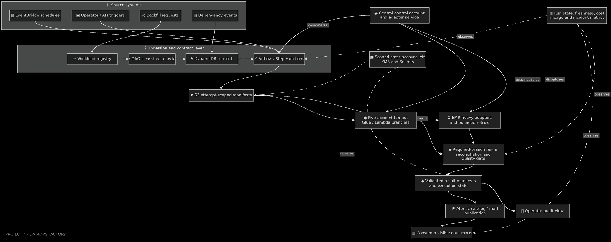

# DataOps Factory Orchestration Platform

[](https://github.com/bhuvaneshwaranmurugan21/dataops-factory-orchestration-platform/actions/workflows/quality.yml)
[](https://github.com/bhuvaneshwaranmurugan21/dataops-factory-orchestration-platform/actions/workflows/orchestration.yml)
[](https://github.com/bhuvaneshwaranmurugan21/dataops-factory-orchestration-platform/actions/workflows/infrastructure.yml)
[](https://github.com/bhuvaneshwaranmurugan21/dataops-factory-orchestration-platform/actions/workflows/spark.yml)
[](pyproject.toml)
[](docs/ARCHITECTURE.md)
[](LICENSE)

I built this control plane to compile a versioned workload registry into a deterministic,
multi-account execution graph. Airflow owns dependency scheduling; one bounded Step Functions
execution owns each Lambda, Glue or EMR Serverless workload. Results are accepted only after the
exact S3 object version, Object Lock state, immutable execution identity, quality policy, budget
and asymmetric KMS signature all verify.



## Reference topology

| Characteristic | Reviewed design | Evidence |
| --- | ---: | --- |
| Explicit jobs | 36 | Registry + deterministic compiler |
| Logical AWS accounts | 5 | Control, commerce, finance, customer, operations |
| Dependency levels | 12 | Checked-in compiled plan |
| Workload adapters | 18 Lambda, 14 Glue, 4 EMR Serverless | Registry contract |
| Local job results accepted | 36/36 | Reproducible correctness simulation |
| Adversarial trials | 19/19 | Reproducible failure lab |
| Python test coverage | 93%+ | Enforced at 90% in CI |

These are repository and local-correctness facts, not claims that this copy has processed a
production workload. Cross-account deployment, AWS recovery behavior and managed-service
throughput remain explicitly stage-gated.

## Correctness model

- The registry is strict: unknown fields, missing dependencies, cycles, invalid digests and unsafe
  retry policies fail compilation.
- A logical run binds to one immutable registry commit and plan digest.
- Leases carry monotonically increasing fencing tokens; stale schedulers cannot mutate new work.
- Every attempt gets a unique output prefix. Retries never overwrite earlier evidence.
- The callback token is persisted before dispatch. Lambda responds synchronously; Glue and EMR
  Serverless are reconciled against their authoritative APIs.
- A signed manifest is bound to the run, job, attempt, fence, artifact, account, output prefix,
  quality policy and cost budget before DynamoDB accepts it.
- Redshift publication is a locked, compare-and-swap stored procedure. Publication is blocked
  until every mandatory predecessor has an accepted manifest.

## Run the local correctness oracle

```bash
python -m venv .venv
source .venv/bin/activate
pip install -e ".[dev]"
make evidence
make verify
```

The oracle executes all 36 jobs with synthetic fixtures, persists the run/attempt/audit model in
SQLite, signs deterministic result manifests, activates the consumer catalog, and runs 19 fault
trials. The retained summaries live under `evidence/verified-local/`; databases and generated data
are deliberately excluded.

For the real Spark contracts:

```bash
pip install -e ".[dev,spark]"
pytest -m spark tests/test_spark_transforms.py --no-cov
```

## Package and deploy the AWS stage

```bash
pip install -e ".[dev,aws]"
make package
terraform -chdir=infrastructure/terraform init
terraform -chdir=infrastructure/terraform plan -var-file=terraform.tfvars
terraform -chdir=infrastructure/terraform apply -var-file=terraform.tfvars
python scripts/bootstrap_redshift.py \
  --workgroup "$(terraform -chdir=infrastructure/terraform output -raw redshift_workgroup_name)" \
  --database dataops \
  --secret-arn "$(terraform -chdir=infrastructure/terraform output -raw redshift_admin_secret_arn)"
```

The deployment expects five pre-bootstrapped account roles. It provisions the control ledger,
callback recovery, versioned and locked evidence buckets, asymmetric signers, least-privilege
cross-account execution roles, workload runtimes, Redshift Serverless publication catalog, alarms
and deterministic artifacts. Follow [the deployment gate](docs/DEPLOYMENT.md) before representing
the stage as verified.

## Repository map

| Path | Purpose |
| --- | --- |
| `contracts/registry/` | Immutable 36-job `JobSpec` registry |
| `src/dataops_factory/` | Compiler, run ledger, manifests, publication and AWS adapters |
| `orchestration/` | Generated plan, Airflow DAG and bounded Step Functions workflow |
| `lambdas/` | Control-plane, workload, reconciliation and publication handlers |
| `spark_jobs/` | Glue/EMR entry points and tested transformations |
| `warehouse/` | Atomic Redshift publication schema and stored procedure |
| `infrastructure/terraform/` | Five-account AWS stage topology |
| `evidence/` | Classified claims and reproducible local summaries |
| `docs/` | Architecture, operations, security, performance and decisions |

## Engineering documents

- [Architecture](docs/ARCHITECTURE.md)
- [Failure model](docs/FAILURE_MODEL.md)
- [Operations and recovery](docs/OPERATIONS.md)
- [Performance and benchmark protocol](docs/PERFORMANCE.md)
- [Threat model](docs/THREAT_MODEL.md)
- [Deployment gate](docs/DEPLOYMENT.md)
- [Architecture decisions](docs/adr/README.md)

## Evidence boundary

`VERIFIED_REPOSITORY` means a deterministic contract can be inspected. `VERIFIED_LOCAL_*` means
the checked-in implementation reproduced the result locally. `UNVERIFIED_STAGE_REQUIRED` means a
real AWS account, service or workload must be exercised. `evidence/claim-registry.json` is validated
in CI so a local simulation cannot silently become a cloud-performance claim.
